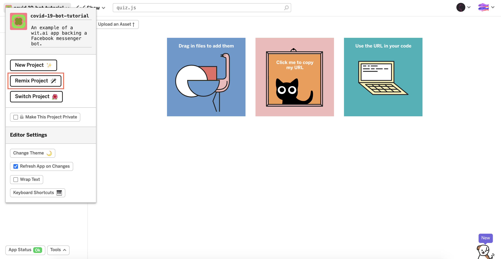
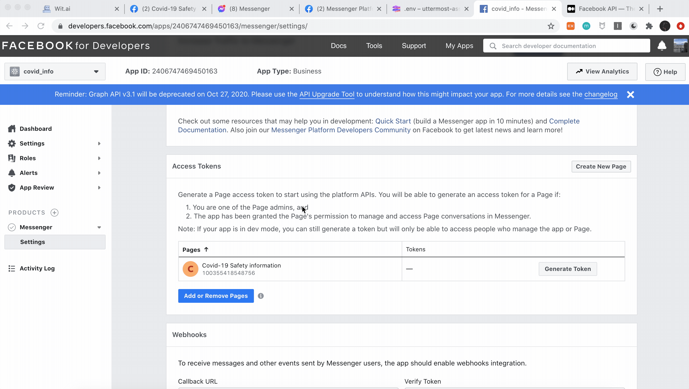
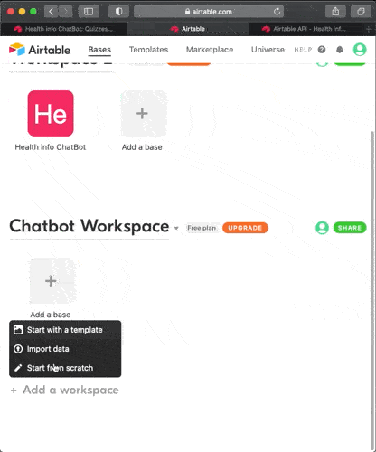
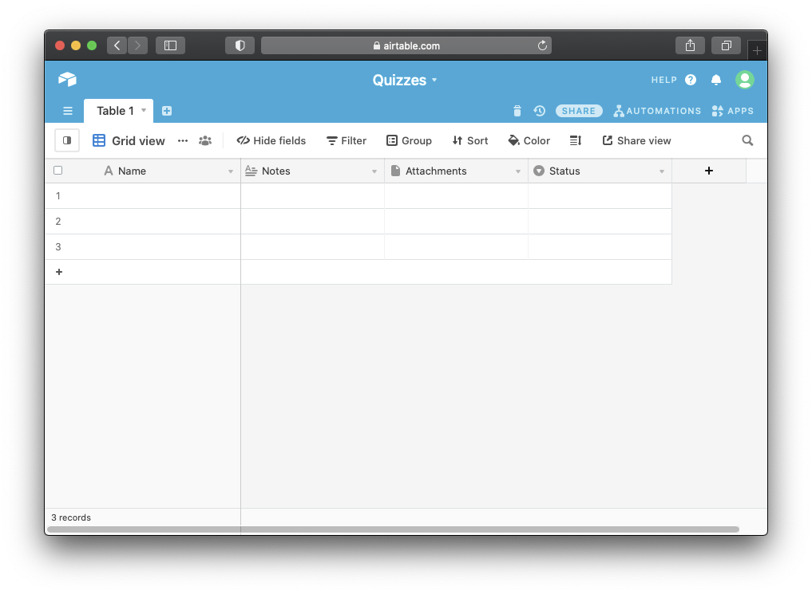
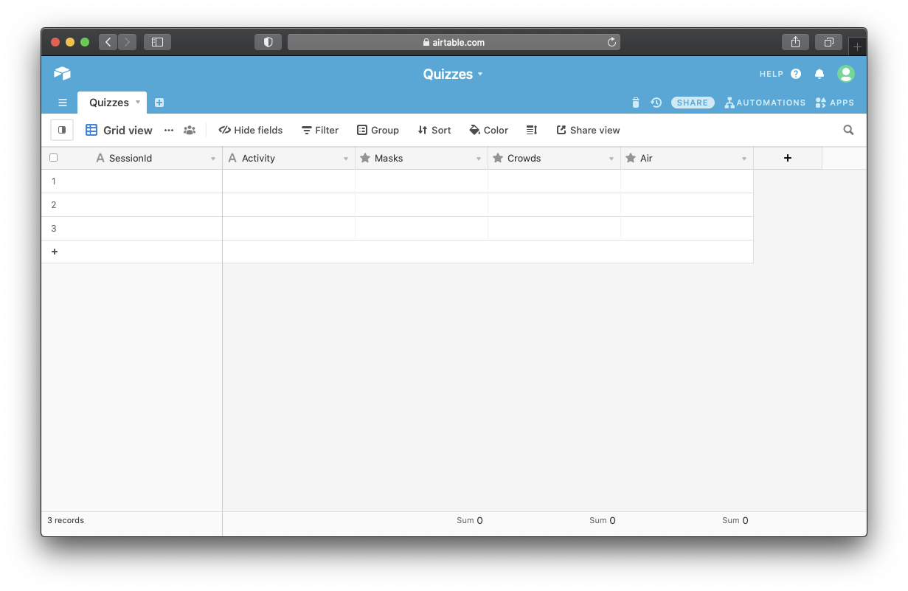

Now, it's time to add a code to hook up all these things together! You'll need a Node.js app to make a bridge between Facebook app and [Wit.ai](http://wit.ai) App. 

## Node App

No need to worry, there is a base code in the [Glitch](https://glitch.com/~covid-19-bot-tutorial) and you can simply copy the whole project with "**Remix Project**" button and adjust it as you want. It is going to be a project with same code but act as a unique App with the unique combination of environment variables.



It is a relatively simple Node.js app, which acts as a server to respond to requests, coming from the Facebook App. It handles two types of requests:

- `GET /webhook` — to setup and verify a webhook URL
- `POST /webhook` — to receive, process and respond to incoming messages

The app consists of four main modules:

### app.js - App entry point.

This is where Express server and [Wit.ai](http://wit.ai) connection sets up and main two webhook request handlers are implemented.

The most notable part is the message handler code:

```js
// Retreiving unique sender id to identify user across different calls
const sender = event.sender.id;

// Define messages as array of objects
// with required `text` parameter for the message
// and a possible `meta` field with potential additional configuration
// to enhance the message with attachments or Quick Replies in the future
//
// Setting it with default message to provide usage guide for new users
let messages = [
  {
    text:
      'You can ask me for advice whether it is safe to perform an activity in COVID-19 pandemic times. For example: "Is it safe to go to a restaurant?"',
  },
];

// Fetching the quiz session object, associated with the sender
// to understand whether you are in the process of quiz 
const currentQuiz = await quiz.getRunningQuiz(sender);

if (currentQuiz) {
  // If you are — pass the inbound text to the handler function 
  // to continue or to end the ongoing quiz
  messages = await quiz.handleQuizAnswer(currentQuiz, text);
} else {
  // Otherwize — pass the text to WIT.AI to recongize intent and activity from it
  const { intents, entities } = await wit.message(text);

  if (intents.length > 0) {
    const topIntent = intents[0];

    if (
      topIntent.name === "safety_info" &&
      Array.isArray(entities["activity:activity"])
    ) {
      const activity = entities["activity:activity"][0].value;
      
      // If recognized intent has the name "safety_info" and "activity:activity" entity 
      // accociated with it - start a new quiz, with current user and activity
      messages = await quiz.startQuiz(sender, activity);
    }
  }
}

// Deliver the message to the user
await messenger.sendMessages(sender, messages);
```

### quiz.js

This is the module, you are free to customize. It has the Quiz Q&A data:

```js
const quizSteps = [
  {
    columnName: "Masks",
    question: "How likely you and people around you will wear a mask?",
    quickReplies: ["🙂 Not likely", "🤷‍♀️ Maybe", "😷 Definitely"],
  },
  {
    columnName: "Crowds",
    question: "How crowded the place will be?",
    quickReplies: ["👨‍👩‍👦‍👦 Crowded", "👫 Maybe", "🧍‍♀️ Not at all"],
  },
  {
    columnName: "Air",
    question: "How enclosed the space will be around you?",
    quickReplies: ["🏡 Enclosed", "🏕 Maybe", "🤸‍♀️ Not at all"],
  },
];
```

Where each step of it has a `question` and set of `quickReplies` to suggest to the User. Field `columnName` represents the name of the column in Airtable, used to store the answer, while User goes through the Quiz. Values, stored in the table are integers in range of 1-3.

### db.js and messenger.js

These modules are used to help establish communication with Facebook Messenger Platform and Airtable API and to provide handy functions to perform basic operations — send messages, retrieve or update a record in Airtable database.

## Environment Variables

Variables which get to set in the environment of the app, before it gets executed. Values then are used in code — this is a common practice to keep secret keys separate from the codebase.

In this project you can control them by modifying the `.env` file and Glitch has a neat UI to manage it:


Now, you are going to fill the environment variables which are required to connect Facebook app and [Wit.ai](http://wit.ai) app.

First, let's get the app secret. Let's go to your Facebook app → Settings → Basic. Copy and paste the **App Secret** in the FB_APP_SECRET of the Glitch `.env`. It may require your facebook password to get **App Secret** for the first time. 


Then, let's get the **WIT_TOKEN**. Go to your [Wit.ai](http://wit.AI) app, copy **Server Access** token and paste it in the  **WIT_TOKEN** of the Glitch `.env`


You also need to provide other environment variables such as **FB_PAGE_TOKEN**, **FB_VERIFY_TOKEN**, **AIRTABLE_API_KEY**, **AIRTABLE_DB_NAME**. We can just type random values for these variables temporarily. 

Go to your Facebook App → Messenger → Settings and generate click "Add callback URL".  You can find callback URL in Glitch → Share → Live app. Paste it and don't forget to add "/webhook" to the end of the url.


The last step is **FB_PAGE_TOKEN**. Go to your Facebook app → Messenger → Settings and generate the token. Remove your previous **FB_PAGE_TOKEN** and paste the token.



## Airtable

Every time your Node app receives the message — you should assume it might be unaware of all previous actions. To keep it in context of ongoing conversation you have to keep the state of it in some **persistence layer.** 

Some apps doesn't require having one, but conversational apps, usually do. In this case, you will keep quiz progress across the dialog events and remove it, once the quiz is completed — you don't need to keep any extra data after it.

You will use [Airtable](https://airtable.com/) as a simple service to store session data for ongoing quizzes and access it with its handy JavaScript library.

Start by signing up for an Airtable account and creating a Workspace.


Next, create a Base. Choose **"Start from scratch"** and give it a name:



Your database will have a table, created for you by default:



You can keep it, but change it for your needs. Change the name of the table to **"Quizzes"** and configure four columns with the following configuration:

- **SessionId** — Single line text
- **Activity** — Single line text
- **Masks** — Rating, Max 3 stars
- **Crowds** — Rating, Max 3 stars
- **Air** — Rating, Max 3 stars

This is what end result should look like:



Now, to connect this table to your Glitch app, you'll need to get its Base id and API Key. The easiest way to get them is to take a peek to its dynamically generated API documentation.

Navigate to: [https://airtable.com/api](https://airtable.com/api) and select a Base to view its API documentation. 

Scroll to **"Authentication"** section, switch to "JavaScript" and turn on "show API key" checkbox:


Let's copy these values and paste them to your `.env` ****file in the Glitch app:

