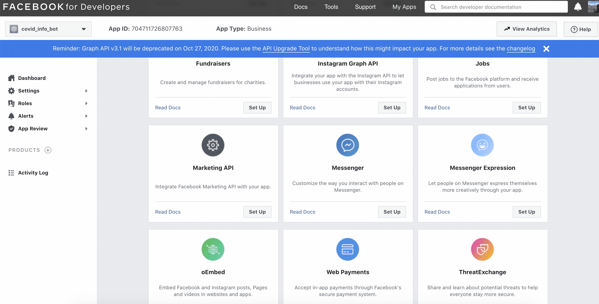

Creating a Facebook app is a way to add service to your Facebook page.   

First, you will need to register as a developer on [Facebook for Developers](https://developers.facebook.com/) portal. It's easy! Just hit the "**Log in"** menu item at the top right corner of the page and accept the legal agreement to get started.

When you are done, "**My Apps**" menu item will become available. Follow it and start creating an app.

As mentioned earlier, Messenger Platform initially was build to benefit and enrich business interactions, so app setup would go easier if you select **"Manage Business Integrations"** category on the first step. If you picked something else, or, literally "Something Else" — not a big deal! You can always customize features and integrations of the app in the future.

After the creation, you can add some products to the app. You are going to need "**Messenger**" — click "**Set up**".

The first thing to do after clicking "**Set up**" button is to connect a Facebook Page with the integration. Follow the steps in the popup window and select your Facebook Page that you want to use the bot with.

