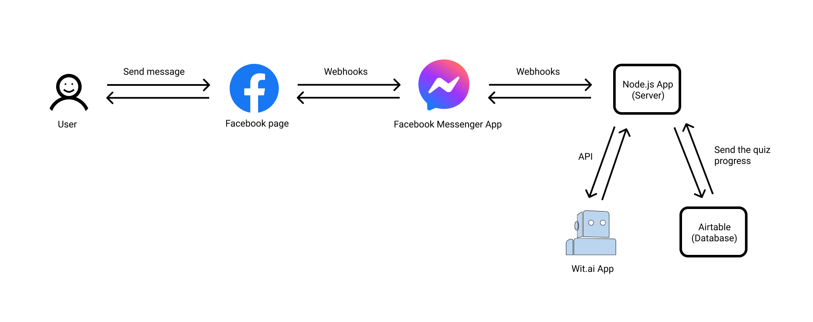

You are going to create a Facebook Messenger Chatbot in this tutorial, which will inform users whether it's safe to perform a certain activity or not. It will also provide a handy advice on how to stay safe during COVID-19 pandemic. 

[Watch the short video about it](https://www.youtube.com/watch?v=FrucqUNOy9A)

After this tutorial, you and your students will know

- How to create a Facebook App
- How to create a [Wit.ai](http://wit.ai) App
- Basic knowledge of training AI models
- Fun of making chatbots!

**Let's start exploring!**

This is the overall flow about what are you going to make.

_Main source for health information is CDC official ["Daily Activities and Going Out" safety guide](https://www.cdc.gov/coronavirus/2019-ncov/daily-life-coping/going-out.html)._