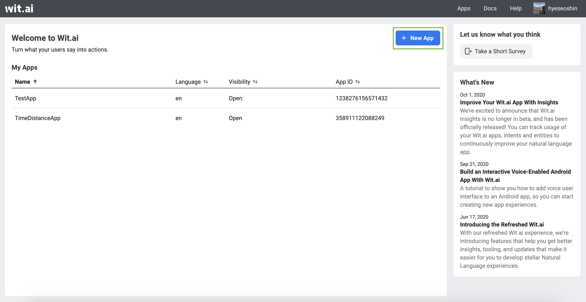
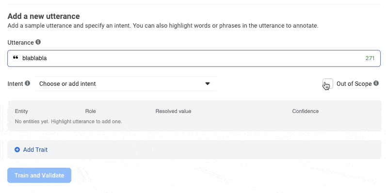

[Wit.ai](http://wit.ai/) is a tool to build an open source chatbot with advanced natural language(speech or messages) processing, or NLP.

Let's start by signing up for Wit.ai account and creating the App. After you signed up, you will see Wit.ai main page. Click "New App" to create an app.

In order to use Wit.ai, you need to **train** the model inside of it.

The goal of training is to create an accurate model that answers our questions correctly most of the time.

To train your Wit.ai app, you need to give **utterances** (questions that users might ask), such as:

  Is going to the gym safe?

  Is it safe to use outdoor dining?

You don’t need to describe every way of the questions. Wit will infer this from the few examples you gave. These examples are the training set of your Wit. So, the more examples you give, the better your app will understand what your users are saying.

You also want to teach Wit that you have some **intent** for these utterances, like getting the safety information. To do so, in the **Choose or add an Intent** dropdown, enter the name of your new intent and click **Create Intent**. 

The app should also be able to handle **gibberish**, a random word that will be marked as "Out of scope". 

You can always get some ideas and examples from already created [Wit.ai](http://wit.ai) App in [here](https://wit.ai/apps/695984467678144/understanding).